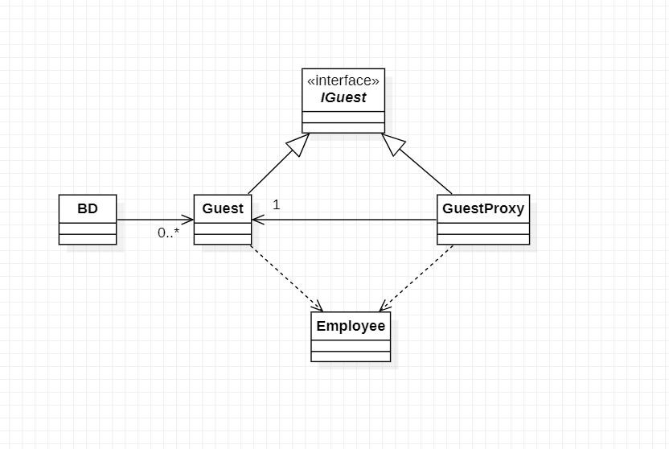

# Padrões de Projeto

## 2. Padrões de Strutural:
___
### 2.6 Proxy

#### 2.6.1 Introdução
O Proxy é um padrão de projeto estrutural que permite que você forneça um substituto ou um espaço reservado para outro objeto. Um proxy controla o acesso ao objeto original, permitindo que você faça algo ou antes ou depois do pedido chegar ao objeto original.

#### 2.6.2 Exemplo abordado

Como exemplo para este padrão abordei de um hotel 
com hospede e funcionarios 
#### 2.6.3 Diagrama de Classe do Exemplo

